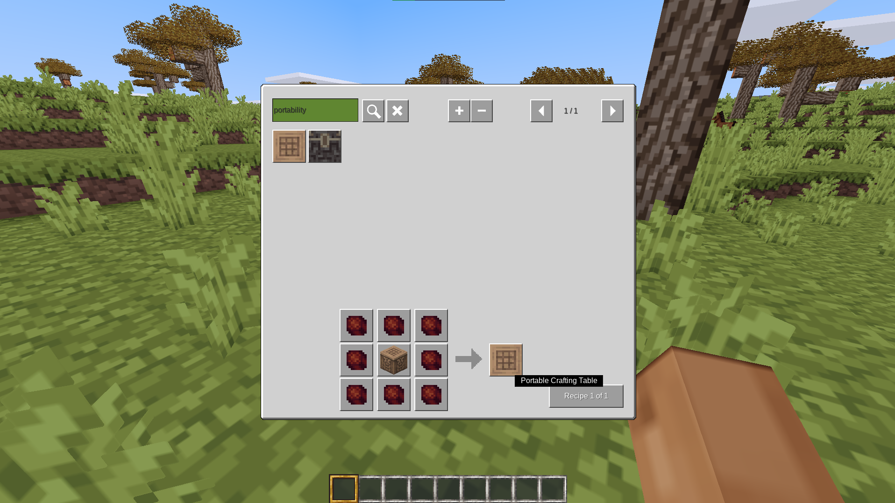
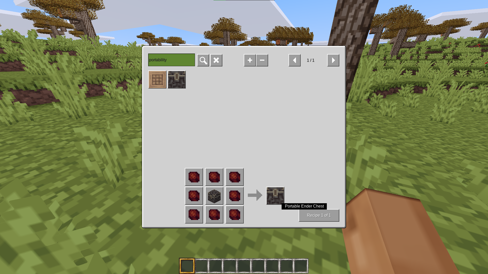
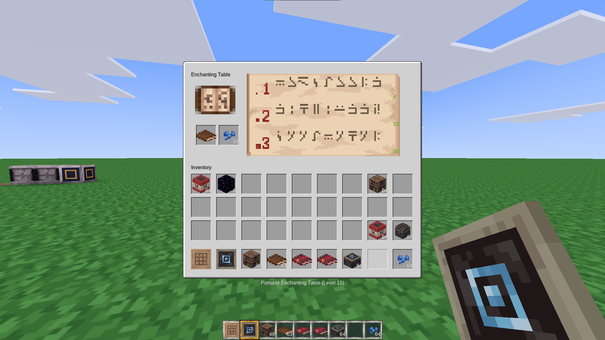
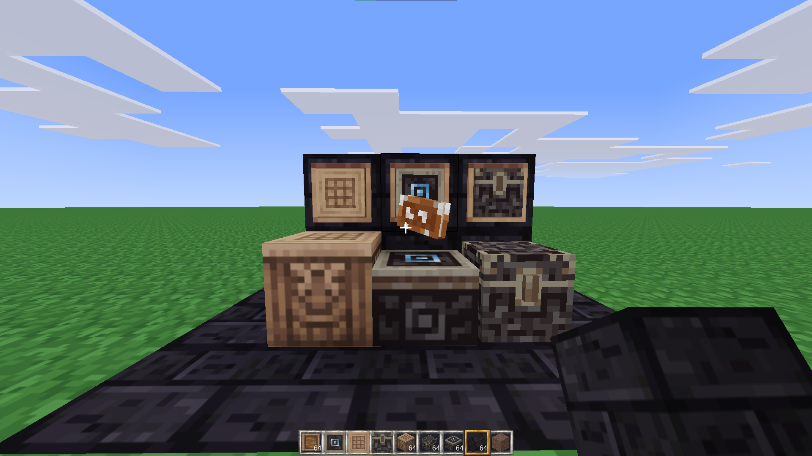

# Portability
A mod that adds portable things to MineClone (crafting table, ender chest, enchanting table? Teleportation device?)
[GitHub repo](https://github.com/thepython10110/portability)
[Forum post](https://forum.minetest.net/viewtopic.php?f=9&t=29330)
[ContentDB](https://content.minetest.net/thepython/portability)

I plan to add these items:
- [x] Portable Crafting Table
- [x] Portable Ender Chest (see warning below)
- [x] Portable Enchanting Table (Upgradable by crafting with bookshelves, downgradable by crafting as well)
- [ ] Maybe a teleportation device (similar to travelnet formspec on right-click, plus add/remove buttons)

I was originally going to add things like portable furnaces, portable anvils, things like that... but after looking at the code for a backpack mod, I decided I don't know enough about Minetest (yet) to deal with detached inventories.

## WARNING
MineClone checks whether you're near an ender chest every time you try to put things into one. This means that *normally*, portable ender chests will not let you insert/remove items unless there's an ender chest nearby. The only way to fix that is to go into MineClone's code and add a line. In your Minetest directory, open `games/mineclone2/mods/ITEMS/mcl_chests/init.lua` in a text editor. Around line 1060 (as of MineClone 0.82.0), there should be code that looks like this (you can also use the find tool and search for "`register_allow`"):
```lua
minetest.register_allow_player_inventory_action(function(player, action, inv, info)
	if inv:get_location().type == "player" and (
		   action == "move" and (info.from_list == "enderchest" or info.to_list == "enderchest")
		or action == "put"  and  info.listname  == "enderchest"
		or action == "take" and  info.listname  == "enderchest"
	) then
		local def = player:get_wielded_item():get_definition()

		if not minetest.find_node_near(player:get_pos(), def and def.range or ItemStack():get_definition().range, "mcl_chests:ender_chest_small", true) then
			return 0
		end
	end
end)
```
This is the code that checks for an ender chest near the player. Add the following line where the blank line is:
```lua
if player:get_wielded_item():get_name() == "portability:ender_chest" then return end
```
This makes it so that if the player is holding a portable ender chest, it will skip that check. This will *not* affect anything else, and even if the mod is disabled or deleted, it won't make anything fail.




